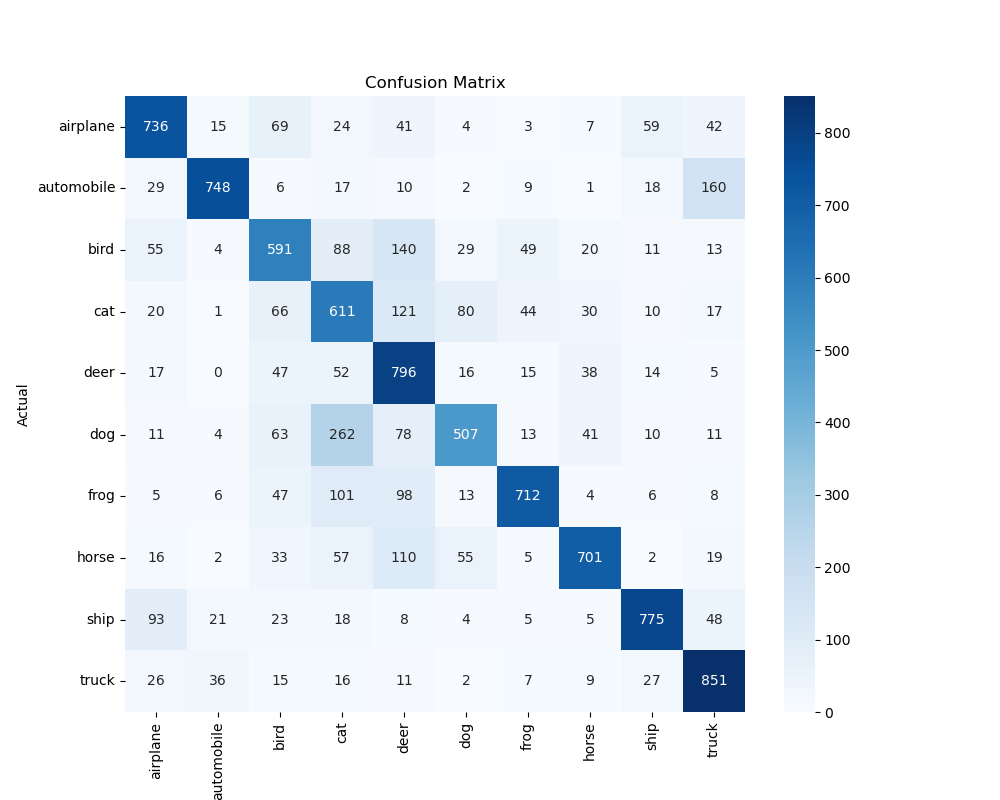
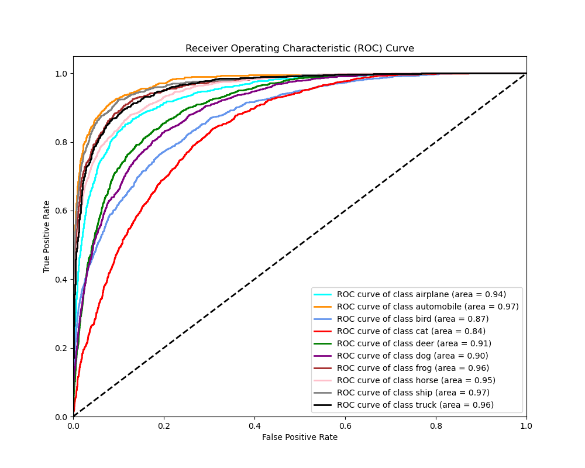
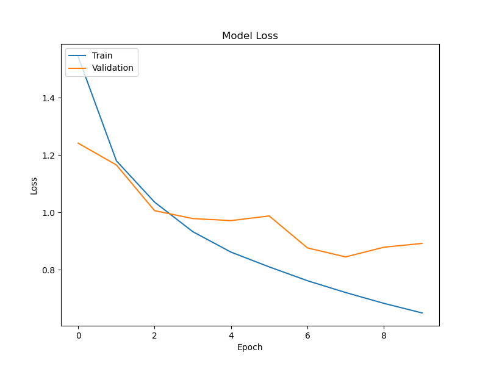
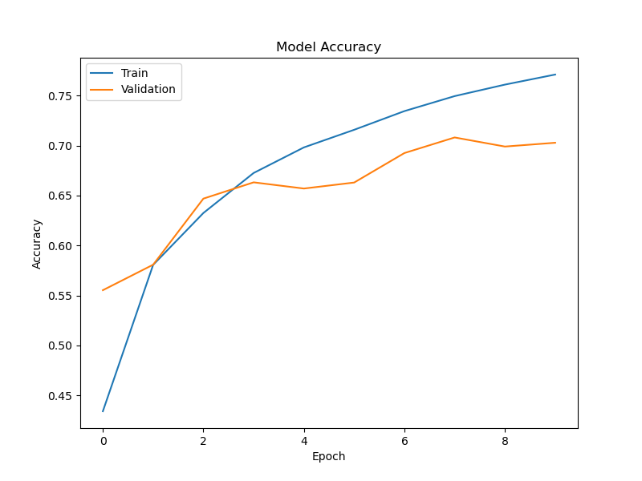

# Image Classification with CNNs

This project demonstrates image classification using Convolutional Neural Networks (CNNs) on the CIFAR-10 dataset.

## Results

### Confusion Matrix

The confusion matrix summarizes the model's predictions compared to the actual values. Each cell represents the number of predictions made for a particular class versus the true class. Diagonal cells show correct predictions, while off-diagonal cells indicate misclassifications.

### Metrics

- **Accuracy**: The model achieved an accuracy of 70%, meaning it correctly predicted 70% of the instances.
- **Precision**: The overall precision is 72%, indicating that 72% of the positive predictions are correct.
- **Recall**: The overall recall is 70%, meaning the model correctly identifies 70% of the true instances.
- **F1 Score**: The overall F1 score is 71%, providing a balance between precision and recall.

### Classification Report

The classification report provides precision, recall, and F1-score for each class:

- The model performs best on "automobile" with a precision of 89% and a recall of 75%.
- The lowest performance is observed in the "cat" class with a precision of 49% and a recall of 61%.
- Overall, the model maintains a good balance across different classes with a weighted average F1 score of 71%.

### Receiver Operating Characteristic (ROC) Curve

The ROC curve illustrates the model's performance across various thresholds by plotting the True Positive Rate (TPR) against the False Positive Rate (FPR). The Area Under the Curve (AUC) is used to summarize the overall performance of the model for each class.

- **Airplane**: AUC = 0.94, indicating excellent performance.
- **Automobile**: AUC = 0.97, showing outstanding discrimination.
- **Bird**: AUC = 0.87, which is very good.
- **Cat**: AUC = 0.84, indicating good performance but slightly lower than other classes.
- **Deer**: AUC = 0.91, demonstrating strong performance.
- **Dog**: AUC = 0.90, showing good performance.
- **Frog**: AUC = 0.96, indicating excellent performance.
- **Horse**: AUC = 0.95, demonstrating strong discrimination ability.
- **Ship**: AUC = 0.97, reflecting outstanding discrimination ability.
- **Truck**: AUC = 0.96, indicating excellent performance.

The high AUC values across most classes demonstrate the model's strong ability to distinguish between different classes.

### Training and Validation Loss

The training and validation loss curves show how the model's performance changes over epochs.

- **Training Loss**: The training loss decreases steadily, indicating effective learning from the training data.
- **Validation Loss**: The validation loss decreases initially but shows some fluctuation, suggesting variability in performance on unseen data.

### Training and Validation Accuracy

The training and validation accuracy curves illustrate the model's ability to correctly classify images over epochs.

- **Training Accuracy**: Increases steadily, indicating the model's improving performance on the training data.
- **Validation Accuracy**: Improves and stabilizes around 70%, showing the model's generalization ability to new data.

